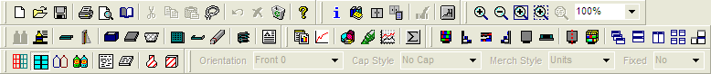
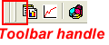

# Spaceman Professional Training
Notes from the Spaceman Professional course from [P&G's Shelf Software Training Center](http://shelftrainingcenter.pg.com/)

Procter and Gamble Introduction to Spaceman Professional web-based training
Advanced training is accessed through the AC Nielsen Company by contacting Hy Libby

> Hy Libby
> hlibby@acnielsen.com
> 831-661-0716

___

* [Introduction to Spaceman](http://shelftrainingcenter.pg.com/Spaceman/module1/page1.htm)
* [Spaceman File Operations](http://shelftrainingcenter.pg.com/Spaceman/module2/page1.htm)
* [Viewing Spaceman Planograms](http://shelftrainingcenter.pg.com/Spaceman/module3/page1.htm)
* [Viewing and Modifying Section Data](http://shelftrainingcenter.pg.com/Spaceman/module4/page1.htm)
* [Remerchandising a Section](http://shelftrainingcenter.pg.com/Spaceman/module5/page1.htm)
* [Adding Products](http://shelftrainingcenter.pg.com/Spaceman/module6/page1.htm)
* [Spaceman Reports and Charts](http://shelftrainingcenter.pg.com/Spaceman/module7/page1.htm)
* [Building and Modifying Sections](http://shelftrainingcenter.pg.com/Spaceman/module8/page1.htm)
* [Spaceman Printing](http://shelftrainingcenter.pg.com/Spaceman/module9/page1.htm)

___

## Introduction to Spaceman

At the end of this module you will be able to:

* Understand what is in and how to use this training
* Use basic Spaceman terminology
* Explain the uses of Spaceman
* Use Spaceman Help
* Identify and use the toolbars and buttons
* Locate and set basic Spaceman defaults

___

### Spaceman Basics

* The Spaceman application is used to create, view, modify, analyze and print sections. A section is the basic element of a planogram. Each planogram can have only one section. It is comprised of a backboard, a base and one or more segments. You can also define the notches for shelf brackets and the peg spacing on a section.
* A section is merchandised with Products placed in Positions on the planogram. All products in a section are held in the Product List.
* A planogram may be viewed from several angles, including front, side, top and even cross-sections.
* Positions on a planogram may be viewed using outlines, shapes, units and LIVE images.
* Various types of reports and charts may be created, viewed and printed to help with your analysis.
* You may open planograms that were created in other applications, such as Space Planning and Apollo. You may also save to those formats.
* You may use the Spaceman library to store sections and products. This will allow you to have quick access to these items in any planogram you may have or create.

___

### Spaceman Help

* The Spaceman application allows you to get help in a variety of ways.
* Open the WINDOW menu and choose CONTENTS to open the Spaceman help file. Here, you can get help by topic, content and searching for keywords. You may also click on the HELP tool for this function.
* You may press the F1 function key to get context specific help when a dialog box is open.
* Pointing to a tool on any of the toolbars will display the name/function of the tool in a popup balloon.

___

### Spaceman Tools

* The various tools on the Spaceman toolbars provide shortcuts to frequently used activities and functions in the application.
* Choosing TOOLS > TOOLBARS > CUSTOMIZE from the menus will allow you to determine what toolbars are displayed.
* Pointing to a tool on any of the toolbars will display the name/function of the tool in a popup balloon.
* Toolbars may be arranged by dragging them by the far left handle of the toolbar.

___

### Spaceman Defaults

* Spaceman allows a wide variety of user settings that you can modify to best meet your needs.
* The default settings may be viewed/changed by choosing TOOLS > OPTIONS from the menus
* Note that when an option includes a default directory, you should choose a directory inside of the MY DOCUMENTS folder. This will insure that the directory will be included in your default backup path.

___

